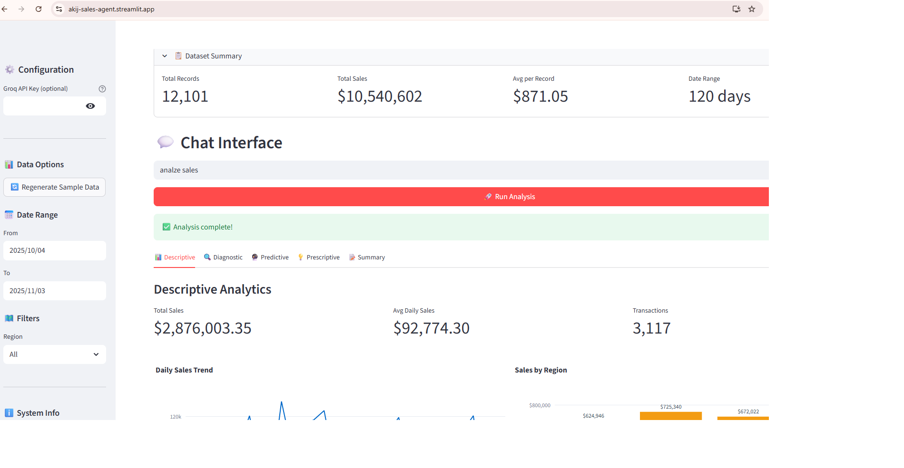

# 🤖 AI Agentic Sales Intelligence System

**Developer:** Basudab Chowdhury Raj  
**Architecture:** LangChain + LangGraph + Groq  
**Status:** 🟢 Online  
**[Try the App Here](https://akij-sales-agent.streamlit.app/)**

---

## 📘 Project Overview
The **AI Agentic Sales Intelligence System** is an advanced, modular framework that leverages **agentic reasoning, retrieval-augmented generation (RAG), and real-time analytics** to automate sales data insights and business intelligence.

Built on **LangChain** and **LangGraph**, the system orchestrates multiple reasoning layers—each responsible for data retrieval, interpretation, and decision-making. It uses **Groq inference acceleration** for ultra-fast LLM responses, enabling near real-time analytics and intelligent task execution.

[](https://drive.google.com/file/d/1t2FvVGvdRAaF7eC-pajXi-dC8RFYRiNL/view?usp=sharing)

---

## ⚙️ Core Features
- 🧩 **Multi-Agent Architecture:** Autonomous agents for data analysis, summarization, and decision reasoning.  
- 🔗 **LangGraph Workflow:** Graph-based orchestration for controlled agent interactions and dependency tracking.  
- ⚡ **Groq-Optimized Inference:** Accelerated LLM processing for low-latency reasoning.  
- 🗂️ **Retrieval-Augmented Generation (RAG):** Integrates structured and unstructured sales data.  
- 📊 **4-Tier Analytics Layers:**  
  1. **Descriptive Analytics** – Summarize “what happened”  
  2. **Diagnostic Analytics** – Explain “why it happened”  
  3. **Predictive Analytics** – Forecast “what will happen”  
  4. **Prescriptive Analytics** – Recommend “what should be done”  
- 🧠 **Memory & Context Retention:** Enables agents to maintain historical context across sessions.

---

## 🛠️ Tech Stack
- **Languages & Frameworks:** Python, Streamlit  
- **AI Orchestration:** LangChain, LangGraph  
- **LLM Engines:** Groq, OpenAI / Anthropic APIs  
- **Data & Analytics:** Pandas, NumPy, scikit-learn, Plotly  
- **Database / Vector Stores:** FAISS or ChromaDB (for RAG)  

---

## 🚀 Vision
This project demonstrates how **agentic intelligence** can transform traditional data pipelines into **autonomous insight systems** — empowering teams to make faster, smarter business decisions.

---

## 🎯 Overview

The Sales Agent System is a sophisticated data analysis platform that applies four layers of analytics to hierarchical sales data:

1. **Descriptive** - "What happened?" → KPIs, aggregations, trends
2. **Diagnostic** - "Why did it happen?" → Root cause analysis, anomalies
3. **Predictive** - "What will happen?" → 14-day sales forecast
4. **Prescriptive** - "What should be done?" → Actionable recommendations

## 🏗️ Architecture

```
┌─────────────────────────────────────────────────────────┐
│                    Streamlit UI                         │
│                  (User Interface)                       │
└─────────────────────┬───────────────────────────────────┘
                      │
                      ↓
┌─────────────────────────────────────────────────────────┐
│              LangGraph Orchestrator                     │
│            (Groq LLM Coordination)                      │
└─────────────────────┬───────────────────────────────────┘
                      │
        ┌─────────────┼─────────────┬────────────┐
        ↓             ↓             ↓            ↓
┌──────────────┐ ┌──────────┐ ┌──────────┐ ┌──────────┐
│ Descriptive  │ │Diagnostic│ │Predictive│ │Prescriptive│
│    Agent     │ │  Agent   │ │  Agent   │ │   Agent   │
└──────────────┘ └──────────┘ └──────────┘ └──────────┘
        │             │             │            │
        └─────────────┴─────────────┴────────────┘
                      │
                      ↓
              ┌──────────────┐
              │  Analytics   │
              │   Engine     │
              └──────────────┘
                      │
                      ↓
              ┌──────────────┐
              │ Sales Data   │
              │    (CSV)     │
              └──────────────┘
```

## 📁 Project Structure

```
sales_agent_system/
│
├── app.py                          # Streamlit UI
├── orchestrator.py                 # LangGraph orchestrator
├── groq_llm.py                     # Groq LLM wrapper
├── tools_agents.py                 # LangChain tool wrappers
├── analytics.py                    # Core analytics logic
├── sample_data.py                  # Dataset generator
├── requirements.txt                # Python dependencies
├── prompts/
│   └── orchestrator_prompt.txt     # LLM system prompt
└── README.md                       # This file
```

## 🚀 Quick Start

### 1. Installation

```bash
# Clone or create project directory
mkdir sales_agent_system
cd sales_agent_system

# Create virtual environment
python -m venv venv
source venv/bin/activate  # On Windows: venv\Scripts\activate

# Install dependencies
pip install -r requirements.txt
```

### 2. Generate Sample Data

```bash
python sample_data.py
```

This creates `sales_sample.csv` with 120 days of synthetic sales data across:
- 4 Products (Product_A, Product_B, Product_C, Product_D)
- 3 Segments (Consumer, Corporate, Home_Office)
- 4 Regions (East, West, North, South)
- 3 Channels (Online, Retail, Direct)

### 3. Set Up Groq API (Optional)

```bash
# Set environment variable
export GROQ_API_KEY="your_groq_api_key_here"

# Or create .env file
echo "GROQ_API_KEY=your_key_here" > .env
```

**Note:** The system works without a Groq API key using mock LLM responses.

### 4. Run the Application

```bash
streamlit run app.py
```

The app will open in your browser at `http://localhost:8501`

## 💻 Usage

### Basic Analysis

1. **Enter your query** in the chat interface:
   - "Analyze last 30 days for all regions"
   - "Show me sales performance by region"
   - "What are the trends and forecasts?"

2. **Configure filters** in the sidebar:
   - Date range (From/To)
   - Region filter (optional)

3. **Click "Run Analysis"** to execute the full pipeline

4. **View results** across five tabs:
   - **Descriptive**: KPIs, charts, time series
   - **Diagnostic**: Root causes, insights, anomalies
   - **Predictive**: 14-day forecast with confidence intervals
   - **Prescriptive**: Actionable recommendations
   - **Summary**: Executive summary and explainability

### Example Queries

```
"Analyze sales for October 2025"
"What's driving the decline in the East region?"
"Forecast next 14 days and suggest actions"
"Compare performance across all channels"
```

## 📊 Output Format

The system returns structured JSON with all analysis layers:

```json
{
  "descriptive": {
    "total_sales": 98000.50,
    "avg_daily_sales": 3266.68,
    "by_region": {
      "West": 28500.00,
      "North": 26000.00,
      "South": 24500.00,
      "East": 19000.00
    },
    "time_series": [...]
  },
  "diagnostic": {
    "best_region": "West",
    "worst_region": "East",
    "insights": [
      {
        "entity": "East",
        "root_cause": "Heavy reliance on Retail channel (65%)",
        "confidence": 0.82
      }
    ]
  },
  "predictive": {
    "forecast_days": 14,
    "forecast_values": [3500, 3600, 3450, ...],
    "total_forecast": 49200.00
  },
  "prescriptive": {
    "actions": [
      {
        "action": "Increase marketing budget in East region by 25%",
        "rationale": "East is underperforming. Boost visibility.",
        "priority": "high",
        "confidence": 0.82
      }
    ]
  },
  "explainability": [...]
}
```

## 🔧 Configuration

### Environment Variables

```bash
GROQ_API_KEY=your_api_key        # Optional: Groq API key
```

### Customization

**Change forecast period:**
```python
# In analytics.py
def predictive_forecast(df, forecast_days=30)  # Default is 14
```

**Modify data generation:**
```python
# In sample_data.py
generate_sales_data(days=180)  # Generate 180 days instead of 120
```

**Adjust LLM parameters:**
```python
# In groq_llm.py
GroqLLM(
    model="llama3-70b-8192",  # Change model
    temperature=0.2,          # Adjust creativity
    max_tokens=3000           # Increase response length
)
```

## 🧪 Testing

### Test Individual Components

```python
# Test analytics engine
from analytics import descriptive_summary, diagnostic_analysis
from sample_data import load_sales_data

df = load_sales_data()
result = descriptive_summary(df)
print(result)

# Test orchestrator
from orchestrator import build_agent_system

agent = build_agent_system(df)
output = agent.analyze("Analyze last 30 days")
print(output)
```

### Run with Mock Data

The system automatically generates sample data if `sales_sample.csv` doesn't exist.

## 📈 Features

### Current Features

✅ Four-layer analytics pipeline  
✅ LangGraph orchestration  
✅ Groq LLM integration  
✅ Interactive Streamlit UI  
✅ Real-time visualizations (Plotly)  
✅ Export to JSON/CSV  
✅ Confidence scoring  
✅ Explainability layer  

### Optional Add-ons (Future)

- [ ] PDF report generation (reportlab)
- [ ] LangGraph workflow visualization
- [ ] OpenAI/Anthropic fallback models
- [ ] SQLite conversation logging
- [ ] Multi-user authentication
- [ ] Real-time data streaming
- [ ] Custom agent plugins

## 🛠️ Troubleshooting

### Common Issues

**Issue**: `ImportError: No module named 'groq'`  
**Solution**: Install dependencies: `pip install -r requirements.txt`

**Issue**: Missing `sales_sample.csv`  
**Solution**: Run `python sample_data.py` to generate data

**Issue**: Groq API errors  
**Solution**: Check API key or use system without key (mock mode)

**Issue**: Streamlit not starting  
**Solution**: Ensure port 8501 is free or specify another: `streamlit run app.py --server.port 8502`

## 📚 Dependencies

| Library | Version | Purpose |
|---------|---------|---------|
| langchain | ≥0.1.0 | LLM orchestration framework |
| langgraph | ≥0.0.20 | Agent graph coordination |
| groq | ≥0.4.0 | Groq LLM client |
| pandas | ≥2.0.0 | Data manipulation |
| scikit-learn | ≥1.3.0 | Machine learning models |
| plotly | ≥5.18.0 | Interactive visualizations |
| streamlit | ≥1.29.0 | Web UI framework |

## 🤝 Contributing

Contributions welcome! Areas for improvement:

- Additional analytics methods (clustering, classification)
- More sophisticated forecasting models (LSTM, Prophet)
- Advanced LLM prompting strategies
- Performance optimizations
- Unit tests and integration tests

## 📝 License

MIT License - feel free to use and modify for your projects.

## 🙏 Acknowledgments

Built with:
- [LangChain](https://langchain.com) - LLM application framework
- [LangGraph](https://github.com/langchain-ai/langgraph) - Agent orchestration
- [Groq](https://groq.com) - Fast LLM inference
- [Streamlit](https://streamlit.io) - Interactive web apps

## 📧 Support
- [Linkedin](https://www.linkedin.com/in/basudab007/) - Connect me
- [Portfolio](https://basudabch.vercel.app/) - Check my profile

For issues, questions, or suggestions:
- Open an issue on GitHub
- Check documentation at [LangChain Docs](https://docs.langchain.com)
- Review Groq API documentation

---

**Happy Analyzing! 📊🚀**
